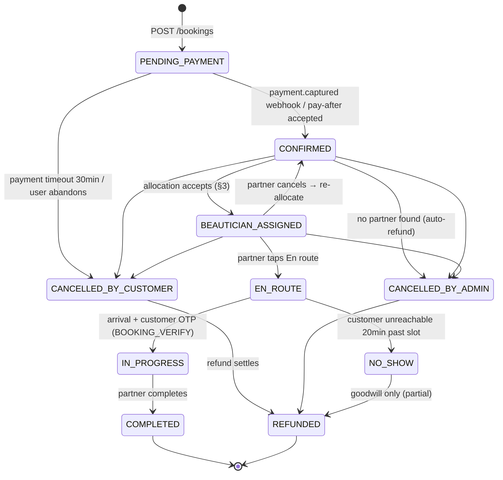

# 07 — Booking Engine

> The core machine. States are exactly the `BookingStatus` enum in `prisma/schema.prisma`;
> every transition writes a `BookingStatusEvent` (audit trail for ops + disputes). Client-side
> wizard state is doc 04 §3; this doc is the server brain.

## 1. State machine



Guards: transitions execute as conditional updates
(`UPDATE bookings SET status='CONFIRMED' WHERE id=? AND status='PENDING_PAYMENT'`) — a lost race
is a no-op, which makes webhook replays safe (doc 05 §6). Illegal jumps (e.g. COMPLETED→EN_ROUTE)
are rejected at the service layer; only ADMIN may force-transition, with a mandatory note.

## 2. Slot generation & real-time availability

Slot grid = `TIME_SLOTS` (07:00 AM–07:00 PM hourly, matching `BRAND.hours`). A slot is offered
for (service, date, serviceArea) when **at least one eligible beautician can take it**:

```
eligible(b, slot) =
      b.status = ACTIVE ∧ b.kycStatus = VERIFIED
    ∧ b has certified BeauticianSkill for service
    ∧ serviceArea ∈ b.serviceAreas
    ∧ AvailabilitySlot covers [start, start + durationMin)      (weekly template)
    ∧ no Booking overlap in [start − travelBuffer, end + travelBuffer)
```

Algorithm (per request, target < 50 ms):

```
1. candidates = beauticians WHERE cityId ∧ ACTIVE ∧ skill(serviceId)
                ∧ serviceArea(areaId)                 -- indexed: (cityId,status)
2. dayTemplate = AvailabilitySlot WHERE dayOfWeek(date)  -- minutes-from-midnight ranges
3. busy = bookings WHERE beauticianId IN candidates AND scheduledDate = date
          AND status IN (CONFIRMED, BEAUTICIAN_ASSIGNED, EN_ROUTE, IN_PROGRESS)
                                                    -- indexed: (beauticianId, scheduledDate)
4. for each grid slot: slot available iff ∃ candidate whose template covers
   slot..slot+duration and interval (±travelBuffer) misses all busy intervals
5. cache result in Redis key slots:{areaId}:{serviceId}:{date}, TTL 60s;
   invalidate on booking create/cancel in that area+date
```

Travel buffer: 30 min base within a `ServiceArea`, 45 min cross-area, tuned per corridor from
ops data (see persona E, doc 02). Same-day slots require lead time ≥ 2 h (members: 90 min).
Capacity display: < 3 candidate-slots free → "Only 2 slots left today" scarcity tag.

## 3. Beautician allocation scoring

On `CONFIRMED` (or when customer chose "No preference"), rank eligible beauticians:

| Factor | Weight | Signal |
|---|---|---|
| Customer preference | hard override | Wizard-selected beautician or repeat pairing (persona C) |
| Rating | 30% | `Beautician.rating` (Bayesian-smoothed: (r·n + 4.5·10)/(n+10)) |
| Proximity | 25% | Haversine from `lastLatitude/lastLongitude` to booking address; decay per km |
| Acceptance rate | 20% | accepts / offers, trailing 30 days (90 s offer TTL, doc 04 §5) |
| Load balance | 15% | Fewer jobs today → higher score (spread earnings, protect quality) |
| Recency online | 10% | `lastSeenAt` freshness / `isOnline` |

Dispatch: offer to top-1 with 90 s TTL → decline/timeout → next candidate; 3 misses → widen to
adjacent service areas → still none 2 h before slot → ops alert on `/admin/dashboard`
("unassigned < 2 h") → manual assign or `CANCELLED_BY_ADMIN` + full refund + ₹200 apology credit.
Bridal bookings (≥ ₹8,000) are assigned at booking time with a named backup artist.

## 4. Dynamic pricing hooks

Price resolution order (server-side, doc 06 §5):

```
unit = ServicePackage.price
     × CityServicePricing.priceMultiplier   (default 1.0; e.g. Muzaffarpur launch 0.9)
     × surge(cityId, serviceId, date)       (only if surgeActive; cap 1.2×; never on bridal)
subtotal = Σ units + Σ addOns
visitFee = subtotal < 999 ? 99 : 0          (mirrors useBookingTotals)
discount = coupon ∨ membership (no stacking, doc 08 §4)
total    = subtotal + visitFee − discount
```

Surge triggers: utilization > 85% for the day (wedding season: Nov–Feb sagan dates) — flagged in
UI as "peak date" with the multiplier shown before payment. Never silently.

## 5. Cancellation / reschedule / refund matrix

| When (before slot) | Cancel fee | Refund | Reschedule |
|---|---|---|---|
| > 24 h | ₹0 | 100% to source (or instant to wallet) | Free, unlimited |
| 6–24 h | ₹0 | 100% wallet / 100% source minus PG fee | Free, max 2 |
| 2–6 h | ₹99 | total − ₹99 to wallet | ₹49 fee or free for members |
| < 2 h / after EN_ROUTE | 50% (cap ₹500) | remainder to wallet | Not allowed — cancel+rebook |
| Customer NO_SHOW | visit fee + 50% (cap ₹500) | remainder wallet (goodwill) | — |
| Partner cancels (any time) | ₹0 | 100% + ₹200 apology credit | Auto re-allocate first, offer reschedule |
| Admin cancels (no supply) | ₹0 | 100% + ₹200 credit | Priority slots offered |
| Payment timeout (30 min PENDING_PAYMENT) | — | auto-void, nothing captured | Cart preserved (Zustand persist) |

Refund routing: wallet = instant (`WalletTransaction` source `BOOKING_REFUND`); source refund =
Razorpay refund API, 5–7 days, status `REFUND_INITIATED → REFUNDED`. Partner compensation: partner
cancel < 6 h costs the partner a strike + queue-priority penalty; customer no-show pays the
partner ₹150 trip compensation from the retained fee.

## 6. Notification triggers

Channels per `NotificationChannel`; WhatsApp is primary (highest open rate), SMS fallback if
undelivered in 5 min, email for receipts. All sends recorded in `Notification`.

| Event | Customer | Partner | Template gist |
|---|---|---|---|
| PENDING_PAYMENT created | — (in-app timer) | — | — |
| CONFIRMED | WA + SMS + email receipt | — | "Booking GN…857 confirmed for Tue 4 PM ✅" |
| BEAUTICIAN_ASSIGNED | WA (photo, name, rating) | Push + WA | "Anjali S (★4.8) will be your artist" |
| Offer to partner | — | Push (90 s TTL) | "New job: Glow Facial · ₹1,299 · 2.1 km" |
| T−24 h reminder | WA | Push | "Tomorrow 4 PM — reply R to reschedule" |
| T−2 h reminder | WA | Push + SMS | "Anjali arrives at 4 PM. Keep a room ready 🌿" |
| EN_ROUTE | WA + push (track link) | — | "Anjali is on the way — track live" |
| IN_PROGRESS (OTP verify) | SMS OTP (BOOKING_VERIFY) | in-app | "Share code 4821 to start your service" |
| COMPLETED | WA (review link) + email invoice | Push (earnings) | "How was your glow? Rate Anjali" |
| CANCELLED_* / REFUNDED | WA + SMS | Push | "₹1,098 refund initiated — 5–7 days" |
| NO_SHOW | WA | Push | apology/goodwill variants |
| Payout PAID | — | WA + SMS | "₹7,220 credited. UTR …" (doc 02 persona D) |
| KYC transition | — | SMS | per-state messages |
| Membership perk unused (D−5) | WA | — | "Your free cleanup expires Friday" |

Quiet hours: marketing 10 AM–8 PM only; transactional exempt. DPDP consent split respected
(doc 06 §7).

## 7. Edge cases

| Case | Handling |
|---|---|
| Payment captured after timeout-void | Webhook finds booking CANCELLED → auto-refund, WA apology; never resurrect the slot |
| Double-tap Pay | `Idempotency-Key` returns first response (doc 05 §6) |
| Slot taken during checkout | `POST /bookings` re-validates → 409 `SLOT_UNAVAILABLE` + alternatives; wizard returns to schedule step with state intact |
| Partner offline after assignment | T−3 h liveness check (`lastSeenAt`); unreachable → silent re-allocation, customer only notified if artist changes |
| Partner cancels day-of | Re-allocate with proximity weight doubled; if replacement ETA > slot+30 min, offer wait/reschedule/full-refund choice |
| Customer no-show | Partner waits 20 min, taps "customer unreachable" → support calls → NO_SHOW per matrix; partner gets trip compensation |
| Service overruns into next job | `durationMin` + buffer breach → next booking flagged amber on ops board; proactive delay WA with ₹100 wallet credit ≥ 15 min |
| Injury/safety flag | Review keyword or partner SOS → URGENT ticket, review unpublished, persona E flow (doc 02) |
| Address unserviceable (pincode outside ServiceArea) | Blocked at wizard address step: "We're not in {locality} yet — join the waitlist" |
| COD (PAY_AFTER_SERVICE) abuse | Allowed ≤ ₹3,000 and ≥ 1 completed prepaid booking; 2 no-shows → COD disabled for account |
